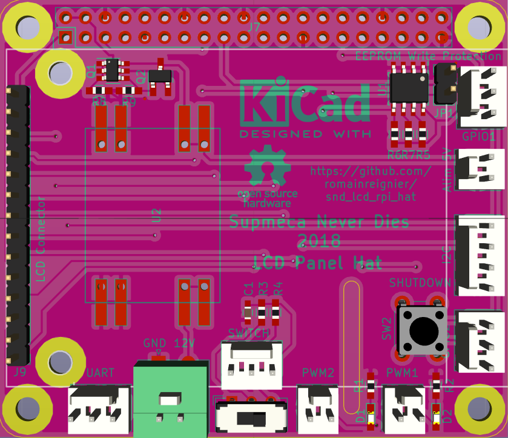

# snd_lcd_rpi_hat

Simple Raspberry Pi HAT PCB to plug a small TFT 2.4" LCD screen.

Designed for the Supmeca Never Dies (SND) team for Eurobot 2018.

The Kicad template is base on <https://github.com/xesscorp/RPi_Hat_Template>.

